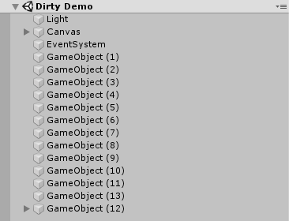
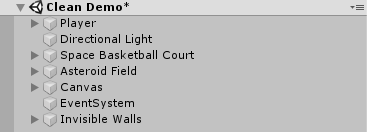

# Unity Coding Best Practices and C# Programming Style Guide <!-- omit in toc --> 

This is a collection of best practices and style conventions that we use across the game design program in [Interactive Arts and Media](https://iam.colum.edu/iamwp/) at [Columbia College Chicago](https://www.colum.edu/).

This is a work-in-progress combining:
- [David's GES best practices and style guide](https://docs.google.com/document/d/1yrKCY_sVAdWkwgWAjJLiJFj1OOHn6dC__pGkSVB61YY/edit)
- [Mike's GES C# style guide](https://github.com/mikewesthad/Columbia-GES-FA2019/blob/master/unity-c%23-style-guide.md)

TODO: create a style cop config (or some other other linter/formatter)

Contributions welcome!

## Table of Contents <!-- omit in toc --> 

- [Golden Rules](#golden-rules)
- [Naming](#naming)
  - [Descriptive Naming](#descriptive-naming)
  - [Casing](#casing)
- [Brace Style](#brace-style)
- [Access Level Modifiers](#access-level-modifiers)
- [List Elements in Order](#list-elements-in-order)
- [Avoid Magic Numbers](#avoid-magic-numbers)
- [Remove Unused Code](#remove-unused-code)
- [Scene Organization](#scene-organization)
- [Folder Organization](#folder-organization)

## Golden Rules

- Favor clarity in your code. Code is meant to be read - by teammates or by yourself in the future - so aim to make your code readable.
- Use consistent style conventions when writing your code. When you write your code in a consistent style, it is easier to read.

## Naming

In gereral, naming should follow C# standards. See Microsoft's [naming conventions guide](https://docs.microsoft.com/en-us/dotnet/standard/design-guidelines/general-naming-conventions) and [capitalization guide](https://docs.microsoft.com/en-us/dotnet/standard/design-guidelines/capitalization-conventions). A few concessions are made to match the Unity style used in their tutorials.

### Descriptive Naming

- Favor clarity and readability over brevity. `CanScrollHorizontally` is more understandable than `ScrollableX`, and both are better than a random variable named `s`!
- Classes/variables/fields/properties should generally be nouns, `explosiveForce` instead of `explode`.
- Methods/functions should generally be verbs, `ApplyHorizontalForce` instead of `HorizontalForce`.
- Bool variables should generally be framed as a question, `isInvulernable` or `hasKey`.

### Casing

| Identifier      | Casing     | Example             |
| --------------- | ---------- | ------------------- |
| Class           | PascalCase | `RadialSlider`      |
| Methods         | PascalCase | `TakeItem()`        |
| Fields          | camelCase  | `craftingInventory` |
| Properties      | PascalCase | `CurrentMusicTrack` |
| Parameters      | camelCase  | `playerLocation`    |
| Local Variables | camelCase  | `explosiveForce`    |

Here is an example that incorperates all of these:

```cs
// PascalCase for Class:
public class BallThrow : MonoBehaviour
{
    // camelCase for fields:
    [SerializeField] GameObject ballPrefab;
    [SerializeField] float shootForce = 10f;
    
    // PascalCase for properties:
    public bool CanShoot { get; private set; }
    
    void Update()
    {
        // camelCase for local variables:
        bool isMouseDown = Input.GetMouseButtonDown(0);
        
        if (CanShoot && isMouseDown)
        {
            ThrowBall(transform.position, transform.forward * shootForce);
            CanShoot = false;
            Invoke("EnableShooting", 1 / shotsPerSecond);
        }
    }
    
    // PascalCase for methods and camelCase for parameters:
    void ThrowBall(Vector3 startingPosition, Vector3 throwForce)
    {
        GameObject ball = Instantiate(ballPrefab, startingPosition, Quaternion.identity);
        Rigidbody ballRigidbody = ball.GetComponent<Rigidbody>();
        ballRigidbody.AddForce(throwForce, ForceMode.Impulse);
    }

    void EnableShooting()
    {
        canShoot = true;
    }
}
```

## Brace Style

All braces get their own line as it is a C# convention:

**AVOID:**

```csharp
class MyClass {
    void DoSomething() {
        if (someTest) {
          // ...
        } else {
          // ...
        }
    }
}
```

**PREFER:**

```csharp
class MyClass
{
    void DoSomething()
    {
        if (someTest)
        {
          // ...
        }
        else
        {
          // ...
        }
    }
}
```

## Access Level Modifiers

- Default to making everything `private`. Only use a more permissive access level (like `public`) when it is necessary.
- Use `[SerializeField]` for exposing parameters in the Unity inspector, not the public access modifers.

## List Elements in Order

List the elements within your classes in the following order:

- Fields
- Constructors
- Enums
- Properties
- Methods

See the [StyleCop docs](https://github.com/DotNetAnalyzers/StyleCopAnalyzers/blob/master/documentation/SA1201.md) for a more detailed order.

## Avoid Magic Numbers

[Magic numbers](https://en.wikipedia.org/wiki/Magic_number_(programming)) are values with unexplained meanings, e.g. `health -= 5`. In those places, prefer variables and/or serialized fields, like `health -= attackDamage`. This will make your code both more readable and flexible.

## Remove Unused Code

- Remove unused Unity methods from the Unity template - e.g. empty `Start` or `Update` methods.
- Remove commented out code.
- Remove unused variables or methods.

## Scene Organization

- Use descriptive and accurate names for your scenes and game objects, e.g. "Player" instead of "Capsule".
- Use empties to organize objects in your scene into logical groups, e.g. "Lights", "Building", "Player", etc.

Here's an example scene configured in two ways:

**AVOID**



**PREFER**



## Folder Organization

Organize your Assets folder logically, e.g. place all materials in a "Materials" folder, all models in a "Models" folder, etc.